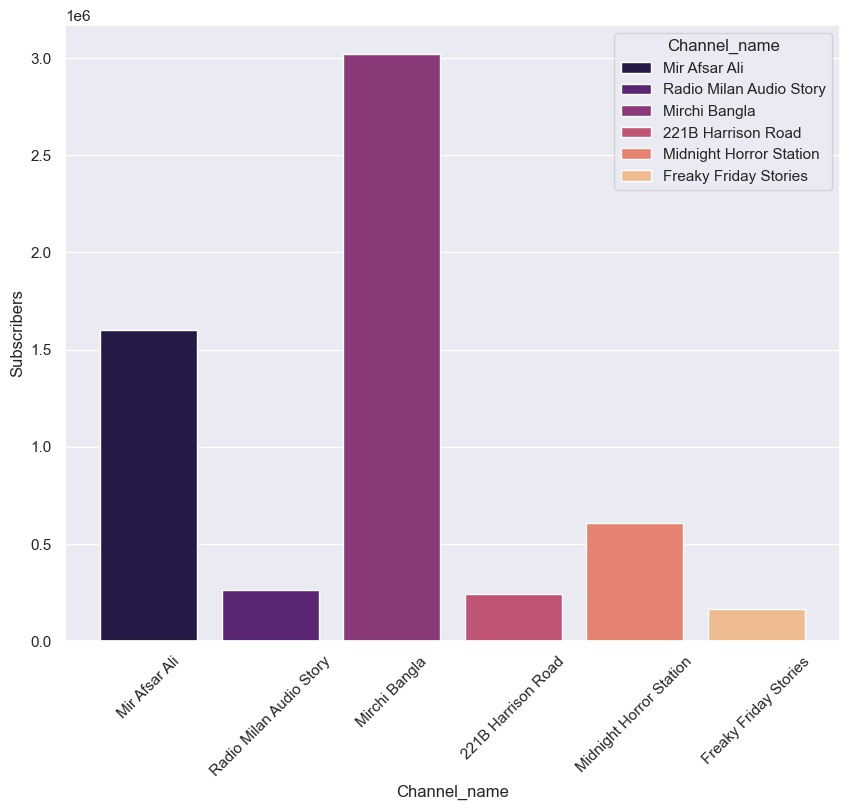
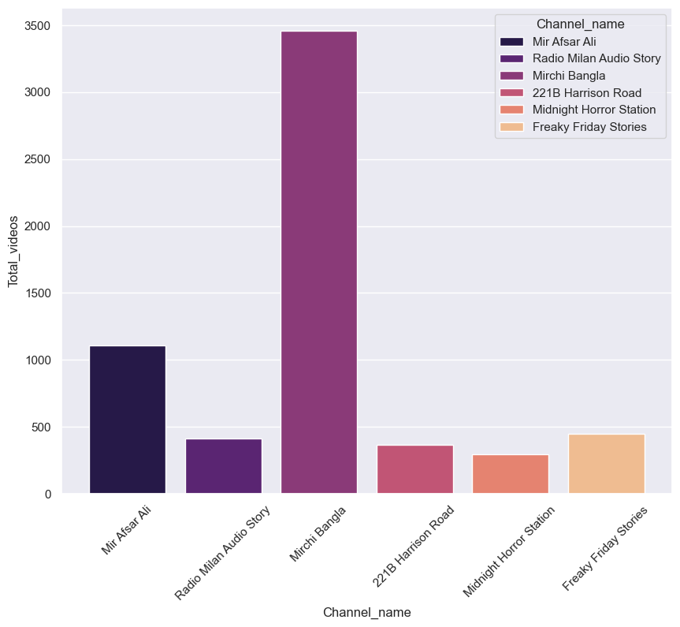
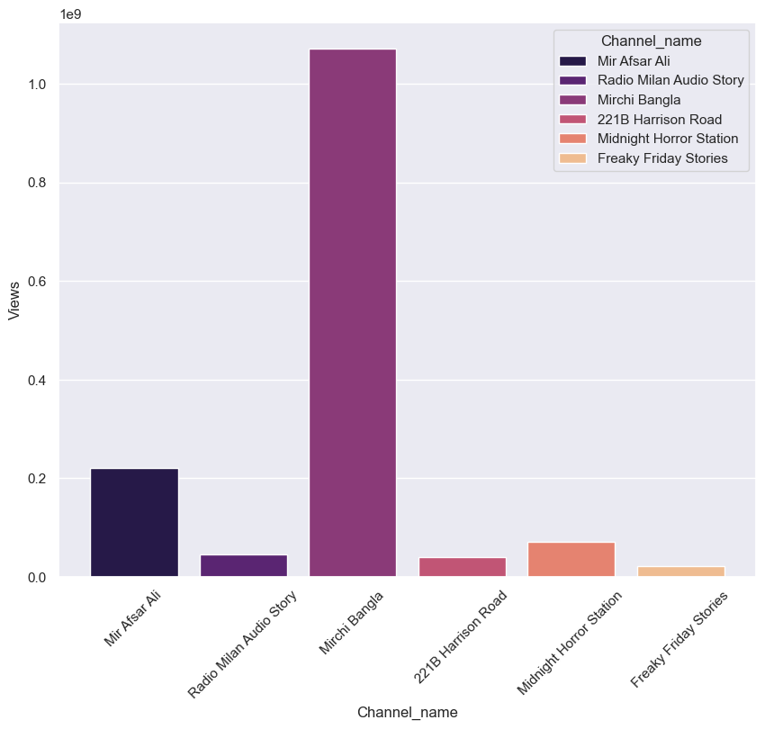

# Bengali Audio Story YouTube Channel Analysis

**Author:** Anjan Paul — Dtata Space Academy, Kolkata

## Project Overview

This project collects and analyzes public metrics for six popular Bengali audio-story YouTube channels using the YouTube Data API. It Summarizes channel-level statistics (subscribers, total views, total videos) in tabular form and creates visual comparisons. Because **Mirchi Bangla** was the most popular channel, the project also performs a deeper video-level scrape and analysis for that channel.

## Features

* Retrieve channel-level metrics: **Subscribers**, **Total Views**, **Total Videos**.
* Export results to CSV (`Mirchi Bangla(video_details).csv`).
* Visual comparisons using Matplotlib/Seaborn (bar charts, histograms, scatterplots).
* Focused video-level analysis for **Mirchi Bangla** (top videos, view distributions, like/view ratios).
* Reproducible Python notebook/scripts for data collection and visualization.

## Requirements

* Python 3.8+
* Libraries:

  * `pandas`
  * `numpy`
  * `matplotlib`
  * `seaborn`
  * `google-api-python-client`, `google-auth-oauthlib`, `google-auth-httplib2` (using the YouTube API)


Install required packages with:

```bash
pip install pandas numpy matplotlib seaborn google-api-python-client google-auth-oauthlib google-auth-httplib2
# Optional scraping tools
```

## Setup (YouTube API)

1. Create a project in the Google Cloud Console and enable the **YouTube Data API v3**.
2. Create an API key (for public data) or OAuth credentials and store them securely.

 ---
## How to Run

1. Clone the repository.
2. (Optional) Create and activate a virtual environment.
3. Install dependencies (see Requirements).
4. Collect channel-level data:

5. Collect Mirchi Bangla video-level data

This produces `Mirchi Bangla(video_details).csv` with video titles, view counts, likes, publish dates, etc.

6. Run analysis and plotting:

Generated charts and CSV files will be saved in the repository's output folder.

## Sample Output

* `Mirchi Bangla(video_details).csv` — detailed video-level dataset for Mirchi Bangla (Published date, Views, Likes, Favorites,	Comments, Month)

* PNG charts comparing subscribers and views across channels, and video-level visualizations.

**Comparing Subscribers**


**Comparing Total Videos**


**Comparing Total Views**

## Notes

* Public API access limits apply; use API key responsibly.
* If scraping, respect YouTube's terms of service and rate limits.

---

If you want, I can add: a `requirements.txt`, example notebook cells showing the API call, or short usage snippets for the main functions.
